# sunSale Module Reference

Per-module reference for `custom_components/sun_sale/`. Companion to `ARCHITECTURE.md` (layer-level prose). The interaction diagram below (§2) is the maintained source — kept inline as Mermaid, no external diagram file.

Each module entry has:
- **Description** — ≤3 sentences on what it does.
- **Exposes** — primary type(s) / class(es) it produces.
- **Depends on** — internal `sun_sale` modules it imports (external deps omitted).
- **Tests** — covering test file(s).

Status legend used in the diagram below: 🟩 has dedicated reference doc · 🟨 covered by tests + this entry only · 🟦 external · ⬜ pure-data / no behaviour.

---

## Contents

1. [Status summary](#1-status-summary)
2. [Interaction diagram](#2-interaction-diagram)
3. [contract/](#3-contract)
4. [inbound/](#4-inbound)
5. [pipeline/](#5-pipeline)
6. [outbound/](#6-outbound)
7. [orchestration/](#7-orchestration)
8. [HA root entry points](#8-ha-root-entry-points)
9. [Open follow-ups](#9-open-follow-ups)

---

## 1. Status summary

| Status | Notes |
|---|---|
| dedicated reference doc | `inbound/{pricing,forecast,battery}.py`, `pipeline/base_load.py`; the inbound telemetry seam (`docs/telemetry_seam.md`); the control loop (`docs/control_loop.md`) and Solis register design (`docs/solis_control.md`). `inbound/generation.py` moved into `inbound/observer/generation.py`; `docs/inbound_generation.md` documents its logic (the path header notes the move). |
| inline-documented here | everything else under `custom_components/sun_sale/` |

---

## 2. Interaction diagram

```mermaid
flowchart TB
    classDef root      fill:#FFF8E1,stroke:#F9A825,color:#5D4037
    classDef orch      fill:#E1BEE7,stroke:#6A1B9A,color:#311B92
    classDef inbound   fill:#C8E6C9,stroke:#2E7D32,color:#1B5E20
    classDef pipe      fill:#BBDEFB,stroke:#1565C0,color:#0D47A1
    classDef out       fill:#FFCCBC,stroke:#D84315,color:#BF360C
    classDef contract  fill:#ECEFF1,stroke:#455A64,color:#263238
    classDef ext       fill:#ffffff,stroke:#9E9E9E,color:#424242,stroke-dasharray:4 3

    HA["Home Assistant<br/>hass.states / services / registry"]:::ext
    SOLIS["solis_modbus<br/>(external integration)"]:::ext

    subgraph ROOT["HA root entry points"]
        R_init["__init__.py<br/>async_setup_entry / services / panel"]:::root
        R_cfg["config_flow.py<br/>ConfigFlow / OptionsFlow"]:::root
        R_sens["sensor.py<br/>SunSale*Sensor entities"]:::root
        R_sw["switch.py<br/>Automation + policy switches"]:::root
        R_sel["select.py<br/>ModeOverrideSelect"]:::root
        R_num["number.py<br/>policy number knobs"]:::root
        R_hastate["ha_state.py<br/>HA-edge reads + unit norm"]:::root
        R_curr["currency.py<br/>display-currency labels"]:::root
    end

    subgraph ORCH["orchestration/"]
        ORCH_coord["coordinator.py<br/><b>SunSaleCoordinator</b>"]:::orch
        ORCH_dbg["debug_view.py<br/>SunSaleDebugView"]:::orch
        ORCH_store["persistent_store.py<br/>PersistentStore"]:::orch
        ORCH_hist["history_stores.py<br/>HistoryStoreSpec"]:::orch
    end

    subgraph INBOUND["inbound/  —  HA-state → typed readings"]
        I_price["pricing.py<br/>price-feed translators<br/>(Nordpool/ENTSO-e/Octopus/Amber/Fixed)"]:::inbound
        I_fc["forecast.py<br/>SolarTranslator"]:::inbound
        I_fcr["forecast_resolver.py<br/>devices + sensor detection"]:::inbound
        I_weather["weather.py<br/>WeatherTranslator + detection"]:::inbound
        I_bat["battery.py<br/>BatteryTranslator"]:::inbound
        I_btsrc["battery_source.py<br/>BatterySource (BMS/inverter)"]:::inbound
        I_hc["household_consumption.py"]:::inbound
        I_mode["inverter_mode.py"]:::inbound
        I_cons["consumption_daily.py"]:::inbound
        I_snap["pre_rollover_snapshot.py<br/>yesterday_total_resolver.py"]:::inbound
        I_disc["inverter_discovery.py<br/>platform_profiles.py"]:::inbound
        I_solis["solis_entity_resolver.py<br/>inverter_entity_resolver.py"]:::inbound
        I_srcs["inverter_sources.py<br/>setup-time source detection"]:::inbound
        subgraph TELE["telemetry/  —  read-side seam"]
            I_tbind["binding.py<br/>TelemetrySignal / SignalBinding"]:::inbound
            I_tcodec["codec.py<br/>TelemetryCodec (sign/unit)"]:::inbound
            I_trdr["reader.py<br/>HaTelemetryReader"]:::inbound
        end
        subgraph OBS["observer/  —  observed-series engine"]
            I_eng["engine.py<br/>ObservedSeriesEngine"]:::inbound
            I_gen["generation.py<br/>Pv/Generation translators"]:::inbound
            I_grid["grid.py<br/>directional observers"]:::inbound
            I_der["derived.py<br/>AcPort/Backup + cons/losses"]:::inbound
            I_bake["bake_in.py"]:::inbound
            I_resamp["recorder_resample.py"]:::inbound
        end
    end

    subgraph PIPE["pipeline/  —  pure-Python DAG"]
        P_engine["dag_engine.py<br/>DagEngine / DagNode / NodeContext"]:::pipe
        subgraph NODES["nodes/  —  DAG node tiers"]
            P_t1["tier1.py<br/>Pricing / BatteryState /<br/>BatteryStatus / BaseLoadProfile"]:::pipe
            P_t2["tier2.py<br/>PriceLevel / Generation / Observed{Gen,<br/>Grid,Consumption,Losses} / Degradation /<br/>BatteryRuntime / Profitability"]:::pipe
            P_t3["tier3.py<br/>Lockout / ForecastAccuracy / MonthlyBill /<br/>ArrayCalibration / SolarHealth / PriceForecast"]:::pipe
            P_t4["tier4.py<br/>ScheduleNode"]:::pipe
        end
        P_tariff["tariff.py"]:::pipe
        P_bat["battery.py<br/>CapacityEstimator"]:::pipe
        P_calc["calculation.py"]:::pipe
        P_phys["slot_physics.py<br/>simulate_slot"]:::pipe
        P_bl["base_load.py"]:::pipe
        P_sched["schedule.py<br/>SoC-bucketed DP"]:::pipe
        P_acc["forecast_accuracy.py"]:::pipe
        P_prof["profitability.py"]:::pipe
        P_mb["monthly_bill.py"]:::pipe
    end

    subgraph OUT["outbound/  —  HA-write + actuation"]
        O_drv["driver.py<br/>InverterDriver / InverterControlDriver"]:::out
        O_fac["driver_factory.py<br/>make_inverter_driver (dispatch)"]:::out
        O_icm["inverter_control_module.py<br/>observe→plan→act→verify→reconcile"]:::out
        O_solisdrv["solis_driver.py<br/>SolisDriver (register-level)"]:::out
        O_disp["solis_dispatch_driver.py<br/>SolisDispatchDriver (44100 block)"]:::out
        O_hb["heartbeat.py<br/>driver-owned liveness timer"]:::out
        O_spec["storage_mode_specs.py<br/>build_specs / decode_mode"]:::out
        O_inv["inverter.py<br/>InverterController (Solis read/write)"]:::out
        O_entity["entity_control.py<br/>EntityControlDriver"]:::out
        O_vendors["{huawei,solax,sungrow,<br/>goodwe,deye}_driver.py<br/>(+ notes-only fronius/sma/kostal)"]:::out
    end

    subgraph CONTRACT["contract/  —  pure data, no deps"]
        C_const["const.py — CONF_* / DOMAIN / defaults"]:::contract
        C_models["models.py — every dataclass"]:::contract
    end

    %% --- HA boundary ---
    HA -->|states| I_price & I_fc & I_hc & I_trdr & I_weather
    SOLIS -.->|registry scan| I_solis
    O_inv & O_entity -->|service calls| HA
    R_init --> HA
    R_cfg --> HA

    %% --- HA root → orchestration ---
    R_init --> ORCH_coord & ORCH_dbg
    R_sens & R_sw & R_sel & R_num --> ORCH_coord
    R_cfg --> I_disc & I_srcs & I_fcr & I_weather & I_price

    %% --- coordinator: the hub ---
    ORCH_coord --> INBOUND
    ORCH_coord --> P_engine
    ORCH_coord --> P_t1 & P_t2 & P_t3 & P_t4
    ORCH_coord --> O_fac & O_icm
    ORCH_coord --> ORCH_store & ORCH_hist

    %% --- DAG node → helper deps ---
    P_t1 --> P_bl & I_bat & I_price
    P_t2 --> P_bat & P_prof & I_fc & OBS
    P_t3 --> P_calc & P_acc & P_mb
    P_t4 --> P_sched
    P_t1 & P_t2 & P_t3 & P_t4 --> P_engine

    %% --- intra-pipeline deps ---
    P_sched --> P_bat & P_phys

    %% --- telemetry seam ---
    I_trdr --> I_tbind & I_tcodec
    I_bat --> I_btsrc & I_trdr
    I_gen & I_grid & I_der & I_resamp --> I_trdr
    I_solis --> I_disc
    I_fc --> I_fcr

    %% --- driver seam dispatch ---
    O_fac --> O_solisdrv & O_entity
    O_solisdrv --> O_inv & O_spec
    O_icm --> O_drv
    O_solisdrv & O_entity -. implement .-> O_drv
    O_vendors --> O_entity

    %% --- inbound → outbound/pipeline (deliberate back-edges) ---
    I_btsrc -->|InverterController| O_inv
    I_mode -->|driver.observe| O_drv
    I_price -->|tariff helpers| P_tariff

    %% --- everyone uses contract ---
    CONTRACT -. types/const .-> ORCH_coord & INBOUND & PIPE & OUT & ROOT
```

**Structural facts (read off the diagram):**

- **Coordinator is the only hub.** Every translator, every node tier, the driver factory + control module, and the persistent stores fan out from `SunSaleCoordinator`.
- **Pipeline is layered by derived tier.** `dag_engine.py` derives tiers from `consumes`/`consumes_optional` at wire-time; nodes in `nodes/tier{1..4}.py` import only helpers and contract types.
- **Both vendor seams are symmetric.** The **outbound** control path goes through `driver.py` (`InverterDriver` / `InverterControlDriver`), dispatched by `driver_factory.make_inverter_driver`; the **inbound** read path goes through `telemetry/` (`HaTelemetryReader` + per-vendor `TelemetryCodec`) and the `inverter_discovery` / `platform_profiles` registry. The control module and the observer translators name a `StorageMode` / `TelemetrySignal`, never a register or a vendor entity.
- **`storage_mode_specs.py` is Solis register detail in the outbound driver layer** — imported only by `outbound/{solis_driver,inverter,entity_control}.py`. `pipeline/slot_physics.py` *mirrors* its per-mode export caps independently (no import).
- **Inbound-on-outbound back-edges** (deliberate): `inbound/battery_source.py` wraps `InverterController` (the inverter-backed `BatterySource`); `inbound/inverter_mode.py` reads/decodes via `InverterControlDriver.observe`; `inbound/pricing.py` calls `pipeline/tariff.py` to apply buy/sell formulas before data enters the DAG.
- **Outbound roles:** `inverter.py` (low-level Solis register read/write), `solis_driver.py` (the register-level `InverterControlDriver`), `entity_control.py` + the `*_driver.py` modules (entity-driven vendors), `inverter_control_module.py` (observe→plan→act→verify→reconcile after the DAG).
- **`contract/` is a sink** — zero internal imports, depended on by every other layer. It holds `const.py` + `models.py` only.

---

## 3. contract/

Pure data types. No imports from any other sun_sale layer. Frozen unless explicitly mutated by the coordinator.

### `contract/const.py`
Configuration key names, storage keys, defaults, retention windows. Pure constants, no logic.
- **Exposes:** `DOMAIN`, `STORAGE_KEY_*`, `CONF_*`, retention constants, Solis defaults, scheduler-policy defaults.
- **Depends on:** none.
- **Tests:** referenced indirectly through every other test.

### `contract/models.py`
Flat catalogue of every immutable dataclass — configs, primary types, secondary types. New node-level types are added here rather than per-feature submodules.
- **Exposes (selected):** `SunSaleConfig`, `BatteryConfig`, `TariffConfig`, `SchedulePolicy`, `PriceEntry`, `PriceSlot`, `PriceSeries`, `PriceFeedData`/`NordpoolData` (alias), `YesterdayPrices`, `SolarData`, `GenerationSeries`, `ObservedGenerationSeries`, `ObservedGridSeries`, `ObservedConsumptionSeries`, `ObservedLossesSeries`, `DerivedPowerSample`, `BatteryReading`, `BatteryState`, `BatteryStatus`, `EstimatedCapacity`, `DegradationCost`, `CalculationResult`, `Schedule`, `ScheduleSlot`, `StorageMode`, `StorageModeSpec`, `InverterModeReading`, `InverterModeChange`, `InverterModeHistory`, grid/`*History` types, `MonthlyBillState`/`Result`, `BaseLoadProfile`, `BatteryRuntimeEstimate`, `ForecastAccuracyResult`, `DailyPeak`, `PriceHistory`, `ProfitabilityScore`, baked/consumption-daily types, … (single source of truth — see file).
- **Depends on:** none.
- **Tests:** `tests/test_models.py`.

---

## 4. inbound/

Translators read HA state; helpers normalise translator output into pipeline-ready shapes. Translators do not import `homeassistant` — they accept a duck-typed `hass`.

### `inbound/pricing.py` 🟩
Multi-region price-source seam (`build_price_translator` → `Nordpool`/`Entsoe`/`OctopusAgile`/`Amber`/`TouSchedule`, all emitting `PriceFeedData`; `NordpoolData` is a back-compat alias) + 72h `PriceSeries` assembly with tariff applied. → **[inbound_pricing.md](inbound_pricing.md)**.

### `inbound/forecast.py` 🟩
`SolarTranslator` + `GenerationSeries` assembly resampled onto the price grid. → **[inbound_forecast.md](inbound_forecast.md)**.

### `inbound/battery.py` 🟩
`BatteryTranslator` (reads SoC/power via the `BatterySource` seam and grid via the telemetry reader, plus the household-load sensor inline) + `BatteryStatus` snapshot. → **[inbound_battery.md](inbound_battery.md)**.

### `inbound/battery_source.py`
`BatterySource` Protocol decoupling battery telemetry (SoC / signed power / today's charge-discharge energy) from the inverter — `InverterBatterySource` (1:1 inverter delegate), `JkBmsBatterySource`, and `ChainedBatterySource` (per-field BMS-primary / inverter-fallback). See `CLAUDE.md` and [`telemetry_seam.md`](telemetry_seam.md).
- **Exposes:** `BatterySource`, `InverterBatterySource`, `JkBmsBatterySource`, `ChainedBatterySource`.
- **Depends on:** `contract.models`, `outbound.inverter` (for the inverter-backed source), `ha_state`.
- **Tests:** `tests/test_battery_source.py`.

### `inbound/telemetry/` (binding.py, codec.py, reader.py)
Vendor-neutral read seam mirroring `outbound/driver.py`. `binding.py` is the pure vocabulary (`TelemetrySignal`, `SignalRole`, `SignalBinding`); `codec.py` is the pure per-vendor sign/unit transform (`TelemetryCodec` → `SolisCodec` / `GenericCodec`, `signed_polarity`); `reader.py` is the live freshness-aware read (`HaTelemetryReader`) + `resolve_bindings`. Reused by `observer/recorder_resample.py` so live and historical reads share one transform. → **[telemetry_seam.md](telemetry_seam.md)**.
- **Exposes:** `TelemetrySignal`, `SignalBinding`, `TelemetryCodec`, `HaTelemetryReader`, `resolve_bindings`, `signed_polarity`.
- **Depends on:** `contract.models`, `ha_state`.
- **Tests:** `tests/test_telemetry_codec.py`, `tests/test_telemetry_reader.py`.

### `inbound/forecast_resolver.py`
Two ways to name a solar array without hunting for entities. `discover_forecast_entries` lists the installed forecast **integrations** and `resolve_forecast_entities` turns each chosen config entry into the base "today" sensor `SolarTranslator` consumes (best-effort per-domain registry scan). `detect_forecast_sensors` covers the long tail no integration does — recognising a sensor by the per-slot data the translator actually parses (`is_forecast_sensor`: a `watts` dict or a `forecast` list, never `wh_period`) and only offering "today" sensors, since the other days are reached by substituting that word. Sensors a chosen device already resolves to are excluded, so an array is never offered twice. `combine_forecast_entities` merges both paths for the runtime.
- **Exposes:** `discover_forecast_entries`, `resolve_forecast_entities`, `detect_forecast_sensors`, `is_forecast_sensor`, `DetectedForecast`, `manual_forecast_entities`, `combine_forecast_entities`.
- **Depends on:** `contract.const`, HA entity registry directly.
- **Tests:** `tests/test_forecast_resolver.py`, `tests/test_config_flow.py`.

### `inbound/weather.py`
`WeatherTranslator` reads one HA `weather` entity's **daily** forecast (wind, temperature, cloud cover where published) for the week-ahead price model — no new cloud dependency, no API key, and whatever source the user already trusts. Hourly forecasts are deliberately unused: the published targets are daily statistics and hourly coverage is typically ~48 h. `detect_weather_entity` picks an entity when none is configured (`weather.forecast_home` → `weather.home` → first available); `detect_weather_entities` lists them all for the setup page, marking the auto-detected one. Every failure path yields empty data rather than raising, since weather is an optional accuracy input.
- **Exposes:** `WeatherTranslator` → `WeatherForecastData`, `detect_weather_entity`, `detect_weather_entities`, `DetectedWeather`, `parse_daily_forecast`.
- **Depends on:** `contract.models`.
- **Tests:** `tests/test_weather_inbound.py`.

### `inbound/inverter_sources.py`
Finds the candidates for the inverter's **optional** sources (PV / AC-port / backup / per-direction grid power, the daily and yesterday energy counters) so the setup pages offer the sensors on the user's inverter instead of every sensor in HA. Locates the inverter's device(s) from whatever its platform's discovery already resolved then classifies the rest against one `SourceSpec` per source: device class, a counter state class for today's counters, and a today/yesterday split on the name (the only signal separating two otherwise identical counters). Candidates are **ranked, never filtered**, so an oddly named sensor stays reachable; the pre-selection is stored value → platform-resolved → best hint. `BMS_SPECS` + `detect_bms_sources` serve the dedicated battery BMS, which is picked as its own device rather than found on the inverter. Advisory only: `inverter_entity_resolver.py` still decides what the runtime reads.
- **Exposes:** `detect_inverter_sources`, `detect_bms_sources`, `device_of`, `role_candidates`, `default_source`, `SourceSpec`, `SourceOptions`, `DetectedSource`, `SOURCE_SPECS`, `SPEC_BY_KEY`, `BMS_SPECS`.
- **Depends on:** `contract.const`, `inbound.inverter_discovery`, `outbound.inverter`, HA entity registry directly.
- **Tests:** `tests/test_inverter_sources.py`, `tests/test_config_flow.py`.

### `inbound/household_consumption.py`
`HouseholdConsumptionTranslator` snapshots the today-total household-load kWh counter (resets at local midnight) — used to display "consumption so far today".
- **Exposes:** `HouseholdConsumptionTranslator` → `HouseholdConsumptionReading`.
- **Depends on:** `contract.models`.
- **Tests:** `tests/test_consumption_daily.py`, `tests/test_coordinator.py`.

### `inbound/consumption_daily.py`
Finalises per-day household-consumption buckets from the derived-power history (and backfills from it), feeding `BaseLoadProfileNode`.
- **Exposes:** `try_finalise_yesterday_consumption`, `backfill_from_derived_history`, `try_finalise_dates`.
- **Depends on:** `contract.{const, models}`.
- **Tests:** `tests/test_consumption_daily.py`.

### `inbound/inverter_mode.py`
`InverterModeTranslator` reads and decodes the inverter's current `StorageMode` per cycle via `InverterControlDriver.observe` (Solis: register 43110 readback + currents + RC setpoint) — it carries no register knowledge of its own. Unreadable fields become `None` → `StorageMode.UNKNOWN`.
- **Exposes:** `InverterModeTranslator` → `InverterModeReading`.
- **Depends on:** `contract.models`, `outbound.driver`.
- **Tests:** `tests/test_inverter_mode_translator.py`.

### `inbound/pre_rollover_snapshot.py` + `inbound/yesterday_total_resolver.py`
Capture the daily-resetting counters just before local midnight (`maybe_capture_snapshots`) and resolve an authoritative yesterday-total (`resolve_yesterday_total`, preferring a dedicated HA entity, falling back to the pre-rollover snapshot) for the observed-series bake-in.
- **Exposes:** `maybe_capture_snapshots`, `resolve_yesterday_total`.
- **Depends on:** `contract.{const, models}`.
- **Tests:** `tests/test_pre_rollover_snapshot.py`, `tests/test_yesterday_total_resolver.py`.

### `inbound/inverter_discovery.py` + `inbound/platform_profiles.py`
Vendor-pluggable entity discovery. `inverter_discovery.py` is the registry — `InverterEntityDiscovery` strategies registered via `register_discovery`, selected by `discovery_for(platform)`; built-ins are `SolisEntityDiscovery` and `GenericEntityDiscovery`. `platform_profiles.py` makes the entity-driven vendors (Huawei / SolaX / Sungrow / GoodWe / Deye) **declarative**: each is a `ControlProfile` of `RoleSpec` rows that one generic resolver + one `ProfileEntityDiscovery` serve, and the config-flow manual form reads off the same profile.
- **Exposes:** `InverterEntityDiscovery`, `discovery_for`, `register_discovery`, `GenericEntityDiscovery`; `ControlProfile`, `RoleSpec`, `ProfileEntityDiscovery`.
- **Depends on:** `contract.const`, HA entity registry directly.
- **Tests:** `tests/test_inverter_discovery.py`, `tests/test_platform_profiles.py`.

### `inbound/solis_entity_resolver.py` + `inbound/inverter_entity_resolver.py`
`SolisEntityDiscovery` / `resolve_solis_entities` scans the HA entity registry for entities of a solis_modbus config entry (matched by `unique_id` pattern), driving the Solis auto-detection path (single entry → auto-selected, multiple → picker, none → manual mapping). `inverter_entity_resolver.py` is the **vendor-neutral front door** — it no longer branches on platform, delegating per-role discovery to `discovery_for(platform)`.
- **Exposes:** `resolve_solis_entities`, `SolisEntityDiscovery`, `resolve_inverter_entities`, `ResolvedInverterEntities`.
- **Depends on:** `inbound.inverter_discovery`, HA entity registry directly.
- **Tests:** `tests/test_solis_entity_resolver.py`, `tests/test_inverter_entity_resolver.py`, `tests/test_config_flow.py`.

### `inbound/observer/`
Shared observed-series subpackage (generation / grid / derived-power bake-in).
- **`engine.py`** — `ObservedSeriesEngine` + `Side` spec; builds per-slot kWh from per-side sample streams by raw averaging.
- **`generation.py`** — `PvPowerTranslator` + `GenerationTranslator` + `build_observed_generation_series` → `ObservedGenerationSeries`.
- **`grid.py`** — `GridImport/ExportPowerObserver` (directional power, signed-net fallback) + `GridImport/ExportTotalTranslator` + `build_observed_grid_series` → `ObservedGridSeries` (gross split per sample).
- **`derived.py`** — `AcPortPowerTranslator` + `BackupPowerTranslator` + `build_observed_{consumption,losses}_series` from the synthetic `DerivedPowerSample`.
- **`bake_in.py`** — `try_bake_yesterday` finalises a (date, side) once via proportional scaling against the authoritative counter total.
- **`recorder_resample.py`** — `RecorderResampler` lifts every observer stream to the inverter's native update rate by replaying the HA recorder's state changes through the shared `TelemetryCodec`, merged into each stream's primary before the DAG runs (incremental fetch; see `CLAUDE.md`).
- **Tests:** `tests/test_observed_engine.py`, `tests/test_generation_inbound.py`, `tests/test_grid_inbound.py`, `tests/test_grid_directional_observers.py`, `tests/test_derived_observer.py`, `tests/test_observed_bake_in.py`, `tests/test_baked_observed_check.py`, `tests/test_recorder_resample.py`.

---

## 5. pipeline/

Pure-Python DAG engine + node logic + helpers. All testable without an HA harness.

### `pipeline/dag_engine.py`
`DagNode`, `DagEngine`, `NodeContext`, `run_translators`. Tiers are **derived** from `consumes`/`consumes_optional` at construction; a cycle raises `DependencyCycleError`. All ready nodes within a tier run concurrently with `asyncio.gather`.
- **Exposes:** `DagEngine`, `DagNode`, `NodeContext`, `MissingDependencyError`, `DependencyCycleError`, `run_translators`.
- **Depends on:** `contract.models`.
- **Tests:** `tests/test_dag_engine.py`, `tests/test_coordinator.py`.

### `pipeline/nodes/` (tier1.py … tier4.py)
The 16 registered `DagNode` subclasses, split by execution tier. Each declares `output_type`, `consumes`, and optionally `consumes_optional`; `DagEngine` derives the tier from those declarations.

| Tier | Node | `output_type` | `consumes` (+ optional) |
|---|---|---|---|
| 1 | `PricingNode` | `PriceSeries` | `PriceFeedData`, `YesterdayPrices` |
| 1 | `BatteryStateNode` | `BatteryState` | `BatteryReading`, `EstimatedCapacity` |
| 1 | `BatteryStatusNode` | `BatteryStatus` | `BatteryReading` |
| 1 | `BaseLoadProfileNode` | `BaseLoadProfile` | `ConsumptionDailyBuckets` |
| 2 | `GenerationNode` | `GenerationSeries` | `SolarData`, `PriceSeries` |
| 2 | `ObservedGenerationNode` | `ObservedGenerationSeries` | `PvPowerHistory`, `PriceSeries`, `BakedObservedHistory` |
| 2 | `ObservedGridNode` | `ObservedGridSeries` | `GridImportPowerHistory`, `GridExportPowerHistory`, `PriceSeries`, `BakedObservedHistory` |
| 2 | `ObservedConsumptionNode` | `ObservedConsumptionSeries` | `DerivedPowerHistory`, `PriceSeries`, `BakedObservedHistory` |
| 2 | `ObservedLossesNode` | `ObservedLossesSeries` | `DerivedPowerHistory`, `PriceSeries`, `BakedObservedHistory` |
| 2 | `DegradationNode` | `DegradationCost` | `BatteryState` |
| 2 | `BatteryRuntimeNode` | `BatteryRuntimeEstimate` | `BatteryStatus`, `BaseLoadProfile` |
| 2 | `ProfitabilityNode` | `ProfitabilityScore` | `PriceSeries`, `PriceHistory` |
| 3 | `LockoutNode` | `CalculationResult` | `PriceSeries`, `GenerationSeries`, `BatteryState` |
| 3 | `ForecastAccuracyNode` | `ForecastAccuracyResult` | `GenerationSeries`, `ObservedGenerationSeries` |
| 3 | `MonthlyBillNode` | `MonthlyBillResult` | `PriceSeries`, `ObservedGridSeries` |
| 4 | `ScheduleNode` | `Schedule` | `PriceSeries`, `CalculationResult`, `GenerationSeries`, `BatteryState`, `DegradationCost`, `BaseLoadProfile`, `SchedulePolicy` (+ optional `ProfitabilityScore`) |

Dispatch happens post-DAG via `InverterControlModule.tick()`, not via events.

- **Depends on:** `pipeline.{base_load, battery, calculation, slot_physics, schedule, forecast_accuracy, monthly_bill, profitability}`, `inbound.{battery, forecast, observer, pricing}`, `contract.models`.
- **Tests:** each node's logic is tested in its helper module's test file.

### `pipeline/tariff.py`
Pure formula: `buy_price` / `sell_price` from spot given a `TariffConfig`; `compute_tariffs(entries, config)` applies them.
- **Exposes:** `buy_price`, `sell_price`, `compute_tariffs`.
- **Tests:** `tests/test_tariff.py`.

### `pipeline/battery.py`
`CapacityEstimator` (counter-anchored learner, serialisable through coordinator persistence) plus `degradation_cost_per_kwh` and `trade_profit_per_kwh`.
- **Exposes:** `CapacityEstimator`, `degradation_cost_per_kwh`, `trade_profit_per_kwh`.
- **Tests:** `tests/test_battery.py`.

### `pipeline/calculation.py`
Computes feed-in lockout windows from negative-sell slots and per-slot decisions; emits user-facing notes. Iterates `PriceSeries.plannable_slots` — real prices **plus** the forecast-filled ones (see `price_fill.py`) — so a plan still exists past the day-ahead auction edge and through a price-feed outage. A bare placeholder still gets no `SlotDecision`, which is what keeps fabricated prices out of dispatch.
- **Exposes:** `compute_calculation(...) → CalculationResult`.
- **Tests:** `tests/test_calculation.py`, `tests/test_price_fill.py`.

### `pipeline/price_fill.py`
Owns the lifecycle of a slot the market has not priced. `fill_from_forecast` replaces the placeholder zero with the shape engine's frozen prediction for that day, run through the same tariff formula a real slot gets, and marks it `forecast=True` (still `priced=False`). `bank_fill_errors` retires the fill the moment real prices arrive: the day's hourly forecast-vs-actual error is banked into `PriceCurveHistory.errors` there and then — the afternoon the auction publishes, not at the next midnight when the day settles.
- **Exposes:** `fill_from_forecast`, `bank_fill_errors`, `SOURCE_FORECAST`.
- **Depends on:** `contract.models`, `pipeline.online_shape`, `pipeline.tariff`.
- **Wired by:** `PricingNode` (Tier 1, fill) and `SunSaleCoordinator._update_price_curve_history` (banking).
- **Tests:** `tests/test_price_fill.py`.

> **Who may act on an unpriced slot.** `priced_slots` = real market prices, and nothing else may book a fact (monthly bill, price level, profitability, the forecast's own settled-day statistics). `plannable_slots` = priced **or** forecast-filled, for calculation and schedule, which only ever produce a plan the next cycle revises. `slots` = everything, for consumers that need the grid rather than the money (generation/observed resampling, the panel).

### `pipeline/slot_physics.py`
Single source of truth for "what does StorageMode X do over one slot, given starting SoC, expected solar/baseload, and buy/sell prices" — `simulate_slot` returns the energy flows (grid in/out, battery charge/discharge, curtailed, …). Both the DP scheduler and any diagnostics route through it so their models agree.
- **Exposes:** `simulate_slot`, `SlotOutcome`.
- **Depends on:** `contract.models`. (Per-mode export caps mirror `outbound/storage_mode_specs.build_specs` by convention — no import; the seam stays pure.)
- **Tests:** `tests/test_slot_physics.py`.

### `pipeline/schedule.py`
SoC-bucketed **backward dynamic programming** over the price horizon → per-slot `StorageMode`. Action set `{SelfUse, NoExport, StandBy, GridCharge, Discharge, FeedIn}`; per-slot physics delegated to `slot_physics.simulate_slot`; terminal battery value tilted by `ProfitabilityScore`, with a mode-change penalty scaled by battery throughput.
- **Exposes:** `optimize_schedule(...) → Schedule`.
- **Depends on:** `contract.models`, `pipeline.slot_physics`.
- **Tests:** `tests/test_schedule.py`.

> `storage_mode_specs.py` is **not** a pipeline module — it is Solis register detail in the outbound driver layer (`outbound/storage_mode_specs.py`, §6).

### `pipeline/base_load.py` 🟩
24h baseload profile (P10 per local-hour bucket) + battery-runtime estimate. → **[pipeline_base_load.md](pipeline_base_load.md)**.

### `pipeline/forecast_accuracy.py`
Per-slot delta between `GenerationSeries` (forecast) and `ObservedGenerationSeries` (measured) → `ForecastErrorSeries` (sign `observed − forecast`), plus EMA quality buckets (intensity / position / time-of-day).
- **Exposes:** `compute_forecast_errors`, `ForecastAccuracyResult`, EMA helpers.
- **Tests:** `tests/test_forecast_accuracy.py`.

### `pipeline/profitability.py`
Day-class-normalised rolling 30d percentile of daily peaks (weekday / weekend / holiday). Wired as `ProfitabilityNode` (Tier 2); `PriceHistory` is supplied by the coordinator from a persistent store of `DailyPeak`s. Holidays come from `inbound/holiday_calendar.py` (the `holidays` package for `hass.config.country`, carried as `SunSaleConfig.holiday_country`); stored WEEKDAY peaks the calendar marks as holidays are promoted on read (`promote_holidays`), so older history needs no migration.
- **Exposes:** `compute_profitability_score`, `daily_peak_from_entries`, `classify_day`.
- **Tests:** `tests/test_profitability.py`.

### `pipeline/monthly_bill.py`
Builds a per-price-slot cost series for the live window `[yday_start, now)` and adds a persisted `carry_eur` from month-start to start of yesterday. Per-slot import/export from `ObservedGridSeries`, priced as `import_kwh*buy − export_kwh*sell` (no floor on `sell`).
- **Exposes:** `compute_bill_slots`, `apply_state_transitions`, `MonthlyBillResult`, `MonthlyBillState`.
- **Tests:** `tests/test_monthly_bill.py`.

---

## 6. outbound/

HA-write + actuation. Platform-specific control lives behind the `InverterControlDriver` seam (`driver.py`); only `inverter.py` and the entity-driven drivers call HA services. `inverter_control_module.py` is the driver-neutral post-DAG observer/dispatcher.

### `outbound/driver.py`
The platform-neutral control seam. `InverterDriver` — minimal surface (`apply_mode`, `hold`, `shutdown`, read grid power); `InverterControlDriver` — adds what the control module orchestrates against (`spec_for` / `control_surface` / `decode_observed` / `observe` / `capability`). `ControlRow` is the neutral intended-vs-observed panel row. No register/entity knowledge — both concrete drivers conform structurally. Battery telemetry is deliberately excluded (lives in `inbound/battery_source.py`). **Liveness is a driver concern:** the protocol says only `hold` ("still the target"); no keep-alive cadence or flag appears here, and the timer machinery lives in `heartbeat.py` so this contract module stays free of HA imports.
- **Exposes:** `InverterDriver`, `InverterControlDriver`, `ControlRow`.
- **Depends on:** `contract.models`.
- **Tests:** exercised via `tests/test_solis_driver.py`, `tests/test_entity_control_drivers.py`, `tests/test_inverter_control_module.py`.

### `outbound/driver_factory.py`
`make_inverter_driver(...)` — the single platform dispatch point. Solis → `SolisDispatchDriver` when the install supports Remote Dispatch, else `SolisDriver`; Huawei / SolaX / Sungrow / GoodWe / Deye → `EntityControlDriver` (lazy-imported per platform); notes-only / unknown → telemetry-only `SolisDriver` wrapper (no-op `apply_mode`). Adding a platform is a new row here plus its `*_driver.py`.
- **Exposes:** `make_inverter_driver`.
- **Depends on:** `outbound.{driver, entity_control, inverter, solis_driver}`, the vendor `*_driver` modules (lazy), `contract.models`.
- **Tests:** `tests/test_solis_driver.py`, `tests/test_entity_control_drivers.py`.

### `outbound/heartbeat.py`
`Heartbeat` — the repeating timer a driver instantiates when its hardware deadman is faster than the coordinator cycle (Solis RC: ~5 min expiry vs a 5-min tick). Deliberately *not* in `driver.py`: that module is the neutral contract and stays HA-import-free, while this is concrete machinery only some drivers need. A failed beat is logged, never fatal — the timer survives to retry.
- **Exposes:** `Heartbeat`.
- **Depends on:** `homeassistant.helpers.event`.
- **Tests:** exercised via `tests/test_solis_driver.py`.

### `outbound/solis_dispatch_driver.py`
`SolisDispatchDriver` — wraps `SolisDriver` and routes the two **forced** modes (Discharge → `grid_export`, GridCharge → `grid_import`) through the inverter's Remote Dispatch block (44100–44112) via `solis_modbus`'s `solis_dispatch` service. Why: the deadman becomes sunSale's to size (`failsafe_minutes`, refreshed by the ordinary holding tick) instead of racing a ~5-min RC expiry that 43282 cannot extend; the writes are raw registers, so neither the `number` entity's same-value short-circuit nor its declared ±10 kW applies; and mode + power + failsafe land atomically. RC is stood down (`rc_setpoint_w=0`) whenever dispatch drives — two mechanisms must never hold power at once. Passive modes and every read delegate to the wrapped driver. Selection is gated by `dispatch_supported()` (service present **and** register 34502 = `0xAA55`), so unsupported installs keep the RC path silently.
- **Exposes:** `SolisDispatchDriver`, `dispatch_supported`, `SERVICE_DISPATCH`, `DISPATCH_CAPABLE_MAGIC`.
- **Depends on:** `outbound.{driver, solis_driver, storage_mode_specs}`, `contract.models`, HA services.
- **Tests:** `tests/test_solis_dispatch_driver.py`; the upstream service/entity contract is guarded by `tests/test_solis_modbus_contract.py`.
- **Caveat:** the 44100 block is a **single-writer resource** — SolisCloud's EMS drives the same registers.

### `outbound/inverter.py`
`InverterController` + `InverterPlatform` enum. Reads live SoC / battery power / grid power (via the telemetry reader / codec it owns), and — **for Solis** — writes the register 43110 storage-mode bitmask, charge/discharge currents, export limit, and RC setpoint. Used by `SolisDriver` for the actual register I/O. Also exports `normalize_power_to_kw`.
- **Exposes:** `InverterController`, `InverterPlatform`, `normalize_power_to_kw`.
- **Depends on:** `contract.models`, `outbound.storage_mode_specs`, `inbound.telemetry` (reader/codec), `ha_state`.
- **Tests:** `tests/test_inverter_solis.py`.

### `outbound/solis_driver.py` + `outbound/storage_mode_specs.py`
`SolisDriver` is the register-level `InverterControlDriver` for Solis — it owns the StorageMode→register spec table, the always-populated intended-vs-observed `control_surface`, and `decode_observed`, wrapping an `InverterController` for the actual reads/writes. `storage_mode_specs.py` holds the Solis register detail (`StorageModeSpec`, `build_specs(...)`, `decode_mode(...)`) — kept out of `contract/` so the shared vocabulary stays platform-neutral. See [`solis_control.md`](solis_control.md).
- **Exposes:** `SolisDriver`; `StorageModeSpec`, `build_specs`, `decode_mode`.
- **Depends on:** `outbound.{driver, inverter, storage_mode_specs}`, `contract.models`.
- **Tests:** `tests/test_solis_driver.py`, `tests/test_inverter_solis.py`.

### `outbound/entity_control.py` + the vendor `*_driver.py` modules
`entity_control.py` is the shared entity/service-driven control layer: `EntityWrite` / `ServiceWrite` primitives, a per-mode `ControlPlan` token, and `EntityControlDriver` (a full `InverterControlDriver` built from a neutral `InverterContext`). The vendor modules (`huawei_driver.py`, `solax_driver.py`, `sungrow_driver.py`, `goodwe_driver.py`, `deye_driver.py`) each supply only *which* entities/services a mode touches — **implemented but untested against hardware**. `fronius_driver.py` / `sma_driver.py` / `kostal_driver.py` are **notes-only** (not implemented).
- **Exposes:** `EntityControlDriver`, `EntityWrite`, `ServiceWrite`, `ControlPlan`, `InverterContext`; `make_<vendor>_driver` per vendor.
- **Depends on:** `outbound.{driver, storage_mode_specs}`, `contract.models`, HA service calls.
- **Tests:** `tests/test_entity_control_drivers.py`.

### `outbound/inverter_control_module.py`
`InverterControlModule.tick(...)` runs **observe → plan → act → verify → reconcile** once per cycle after the DAG, against the injected `InverterControlDriver` — it names no register (see `ARCHITECTURE.md §5` and [`control_loop.md`](control_loop.md)). Writes once on change; verifies the control surface took; reconciles a later drift; refreshes keepalive modes each cycle. A `select.sunsale_mode_override` button press routes straight to `dispatch_override`.
- **Exposes:** `InverterControlModule`.
- **Depends on:** `contract.{const, models}`, `outbound.driver`.
- **Tests:** `tests/test_inverter_control_module.py`, `tests/test_coordinator.py`.

> Dispatch is not event-driven: the module reads the `Schedule`'s per-slot `StorageMode` directly.

---

## 7. orchestration/

Glue: schedule, persistent stores, type↔string bridge to sensors.

### `orchestration/coordinator.py`
`SunSaleCoordinator(DataUpdateCoordinator)`. Builds translator + node lists, owns the persistent stores, injects coordinator-side primaries (`YesterdayPrices`, `EstimatedCapacity`, `SchedulePolicy`, history primaries), runs `DagEngine`, calls `InverterControlModule.tick()` (and `dispatch_mode_override` on a button press), and builds the string-keyed sensor dict.
- **Exposes:** `SunSaleCoordinator`.
- **Depends on:** all `inbound/` (incl. `battery_source`, `telemetry`, `inverter_discovery`), all `pipeline/nodes/`, `pipeline.{battery, dag_engine, forecast_accuracy, profitability, schedule}`, `outbound.{inverter, driver_factory, inverter_control_module}`, `orchestration.{persistent_store, history_stores}`, `contract.{const, models}`.
- **Tests:** `tests/test_coordinator.py`.

### `orchestration/persistent_store.py`
Typed wrapper around HA's `Store` with optional list append-and-trim semantics.
- **Exposes:** `PersistentStore[T]`.
- **Tests:** indirectly via `tests/test_coordinator.py`, `tests/test_history_stores.py`.

### `orchestration/history_stores.py`
Declarative registry (`HistoryStoreSpec`) for the rolling sample-history stores (generation, PV power, both grid-power directions, both grid today-totals, derived cross-stream sample). Captures the identical serialize/trim/inject shape once so a new series costs one table entry.
- **Exposes:** `HistoryStoreSpec`, the spec table, build/inject helpers.
- **Depends on:** `contract.const`, `orchestration.persistent_store`.
- **Tests:** `tests/test_history_stores.py`.

### `orchestration/debug_view.py`
HTTP view at `/api/sun_sale/debug` exposing the most recent `primary`, `secondary`, inputs, and outputs as JSON for the panel UI and `tools/integration_check.py`.
- **Exposes:** `SunSaleDebugView`.
- **Depends on:** `contract.const`.
- **Tests:** `tests/test_debug_view.py`.

---

## 8. HA root entry points

### `__init__.py`
`async_setup_entry` / `async_unload_entry`, panel registration, debug view, and the `force_recalculate` + `force_verify_inverter_mode` services. Serves the bundled panel at `/sun_sale_static/sun-sale-panel.js`.
- **Tests:** `tests/test_init.py`.

### `config_flow.py`
Binds the setup menu tree to HA: `SunSaleConfigFlow` (root step `hub`, creates the entry) and `SunSaleOptionsFlow` (root step `init`, seeds from the entry and writes options). All steps come from `setup_flow.SetupHub`.
- **Exposes:** `SunSaleConfigFlow`, `SunSaleOptionsFlow` (re-exports `INVERTER_PLATFORMS`, `IMPLEMENTED_INVERTER_PLATFORMS`).
- **Depends on:** `setup_flow`, `contract.const`.
- **Tests:** `tests/test_config_flow.py`.

### `setup_flow/`
The setup menu tree (root → section menus → one-module pages), shared by both flows.
- `fields.py` — shared selectors, `req`/`opt`/`suggest`, the Confirm dropdown (`go_to`, `with_next`), `missing_required`, and the detected-source list (`detected_selector`, `detected_options`, the reserved `OTHER` / `NONE` rows).
- `prices.py`, `tariffs.py`, `inverter.py`, `forecast.py` — each section's form schemas, validators and placeholder defaults (no flow state). `tariffs.py` holds the buy / sell formula, grid-fee and schedule forms.
- `sections.py` — section / page ids, labels, `BACK_NAMES` window names, optional-page hints.
- `core.py` — `HubCore`: accumulated data, confirmed pages, status lines, menu navigation, Solis / profile auto-detect (`hass.config_entries.async_entries`), device-name lookup.
- `price_steps.py`, `inverter_steps.py` — per-section step handlers as `HubCore` mixins.
- `hub.py` — `SetupHub`: the mixins composed, plus installation name, solar forecast and Finish.
- **Source pickers.** Wherever a page names a data source it offers what was found rather than every entity: detected price sensors and export feeds (`inbound.pricing`), forecast integrations and sensors (`inbound.forecast_resolver`), weather entities (`inbound.weather`), the inverter's optional sources and a battery BMS (`inbound.inverter_sources`). Each degrades to a plain entity picker when nothing is detected, and keeps an **Other** escape to the whole system.
- **Depends on:** `contract.{const, install_capabilities}`, `inbound.{forecast_resolver, inverter_sources, platform_profiles, pricing, weather}`, `outbound.inverter`.

### `sensor.py`
All HA sensor entities; reads from the string-keyed `coordinator.data` dict.
- **Tests:** `tests/test_sensor.py`.

### `switch.py`
`AutomationSwitch` (master kill-switch; when off the scheduler path issues no commands) plus the scheduler-policy switches `UseStandby` / `AllowGridCharging` / `AllowFeedIn` / `AllowDischargeToGrid` (folded into `SchedulePolicy`).
- **Tests:** `tests/test_switch.py`.

### `select.py`
`ModeOverrideSelect` — `select.sunsale_mode_override`, the single source of operator mode intent (dispatchable `StorageMode` values + the `sunsale` sentinel). A button press calls `coordinator.dispatch_mode_override` for instant actuation.
- **Tests:** `tests/test_select.py`.

### `number.py`
Scheduler-policy number knobs: `ModeChangePenalty`, `ProfitabilityTiltAlpha`, `TerminalValueDiscount`, `MaxDischargeToGridKw` — each mirrors a coordinator attribute folded into `SchedulePolicy`.
- **Tests:** `tests/test_number.py`.

### `ha_state.py`
Shared HA-edge state-reading and unit-normalisation helpers used by every translator and the inverter controller. Centralises the "not-a-reading" guard (unmapped / missing / `unavailable` / `unknown` / blank) and the raw→canonical rescale (W/mW/MW→kW, Wh/MWh→kWh). Deliberately imports nothing from the sunSale package (types `hass` as `Any`) so it is usable from `inbound`, `outbound`, and `orchestration` without an import cycle.
- **Exposes:** `available_state`, `read_float_state`, `read_power_kw` (freshness-aware), `read_soc_fraction`, `normalize_power_to_kw`, `power_unit_scale`, `normalize_energy_to_kwh`.
- **Tests:** `tests/test_ha_state.py`.

### `currency.py`
Display-currency resolution and label/icon helpers. The optimisation math is currency-neutral (every monetary figure is a per-kWh quantity in the price source's own unit); this module only affects presentation — the unit labels/icons on sensors and number entities and the panel axis/tooltip text. Kept separate from `ha_state.py`, which by contract imports nothing from the sunSale package.
- **Exposes:** `resolve_currency`, `currency_unit`, `per_kwh_unit`, `currency_icon`.
- **Tests:** `tests/test_currency.py`.

---

## 9. Open follow-ups

### Hardware verification of the entity-driven vendors
The Huawei / SolaX / Sungrow / GoodWe / Deye drivers (`outbound/entity_control.py` + the `*_driver.py` modules) and their telemetry codecs / discovery profiles are implemented and unit-tested against synthetic states, but **not verified on real hardware**. First-connect verification of each vendor's role patterns, option labels, and service shapes is the remaining work before they can be recommended.

### Candidates for the next reference-doc pass
1. `pipeline/schedule.py` + `pipeline/slot_physics.py` — the DP and its per-slot physics are the central business logic and deserve a dedicated doc.
2. `pipeline/monthly_bill.py` — carry/live split + month-rollover semantics.
3. `pipeline/profitability.py` — day-class normalisation + the rolling daily-peak percentile.

> The Solis register state machine is documented in [`solis_control.md`](solis_control.md); the driver-neutral dispatch contract that realises it (Schedule slot → verified writes) is in [`control_loop.md`](control_loop.md); the read-side seam is in [`telemetry_seam.md`](telemetry_seam.md).
